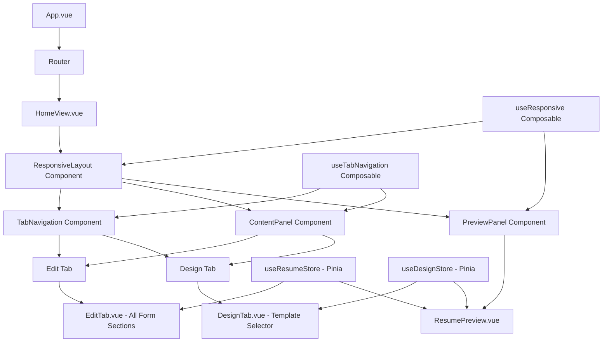
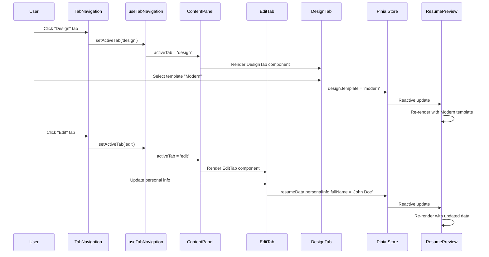

# Design Document: Responsive Tabs Feature

## Overview

This feature adds responsive design capabilities and a two-tab interface (Edit and Design tabs) to the Vue.js resume builder application. The Edit tab consolidates all resume form sections, while the Design tab enables template selection similar to resume.io. The design ensures optimal user experience across mobile, tablet, and desktop devices with adaptive layouts that maintain usability and visual appeal at all screen sizes.

The implementation leverages Vue 3 Composition API with TypeScript, Tailwind CSS for responsive utilities, and Pinia for state management. The architecture separates concerns between layout management, tab navigation, and content rendering while maintaining reactive data flow throughout the application.

## Architecture



### Architecture Explanation

The architecture follows a component-based approach with clear separation of concerns:

1. **ResponsiveLayout Component**: Orchestrates the overall layout, manages breakpoint detection, and coordinates panel visibility
2. **TabNavigation Component**: Handles tab switching UI and active state management
3. **ContentPanel Component**: Renders the active tab content (Edit or Design)
4. **PreviewPanel Component**: Wraps the resume preview with responsive scaling logic
5. **Composables**: Provide reusable reactive logic for responsiveness and tab state
6. **Pinia Stores**: Centralize resume data and design configuration state

## Main Workflow



## Components and Interfaces

### Component 1: ResponsiveLayout

**Purpose**: Manages the overall responsive layout structure, detects screen size breakpoints, and coordinates panel visibility based on device type.

**Interface**:
```typescript
interface ResponsiveLayoutProps {
  // No props - uses composables for state
}

interface ResponsiveLayoutEmits {
  // No emits - state managed internally
}

// Composable return type
interface UseResponsiveReturn {
  breakpoint: Ref<'mobile' | 'tablet' | 'desktop'>
  isMobile: ComputedRef<boolean>
  isTablet: ComputedRef<boolean>
  isDesktop: ComputedRef<boolean>
  screenWidth: Ref<number>
  layoutMode: ComputedRef<'stacked' | 'side-by-side'>
}
```

**Responsibilities**:
- Detect and track current screen breakpoint (mobile < 768px, tablet 768-1024px, desktop > 1024px)
- Determine layout mode (stacked for mobile/tablet, side-by-side for desktop)
- Provide responsive context to child components
- Handle window resize events with debouncing
- Manage panel visibility transitions

### Component 2: TabNavigation

**Purpose**: Renders tab buttons and manages active tab state with visual feedback.

**Interface**:
```typescript
interface Tab {
  id: 'edit' | 'design'
  label: string
  icon?: string
}

interface TabNavigationProps {
  tabs: Tab[]
  modelValue: 'edit' | 'design'
}

interface TabNavigationEmits {
  (e: 'update:modelValue', value: 'edit' | 'design'): void
}
```

**Responsibilities**:
- Render tab buttons with active state styling
- Emit tab change events
- Support keyboard navigation (arrow keys, Enter)
- Provide accessible ARIA attributes
- Apply smooth transition animations


### Component 3: ContentPanel

**Purpose**: Dynamically renders the active tab content (EditTab or DesignTab) with transition animations.

**Interface**:
```typescript
interface ContentPanelProps {
  activeTab: 'edit' | 'design'
}

interface ContentPanelEmits {
  // No emits - content changes handled by child components
}
```

**Responsibilities**:
- Dynamically render EditTab or DesignTab based on activeTab prop
- Apply fade/slide transition animations between tabs
- Maintain scroll position when switching tabs
- Provide consistent padding and spacing
- Handle loading states if needed

### Component 4: EditTab

**Purpose**: Consolidates all resume form sections (Personal Info, Experience, Education, Skills) into a single scrollable interface.

**Interface**:
```typescript
interface EditTabProps {
  // No props - uses Pinia store directly
}

interface EditTabEmits {
  // No emits - updates go directly to store
}
```

**Responsibilities**:
- Render all form sections in a vertical layout
- Provide accordion/collapsible sections for better organization
- Handle form validation and error display
- Support add/remove operations for repeatable sections
- Auto-save changes to Pinia store
- Maintain responsive form layouts


### Component 5: DesignTab

**Purpose**: Provides template selection UI with visual previews, allowing users to choose resume templates similar to resume.io.

**Interface**:
```typescript
interface Template {
  id: string
  name: string
  description: string
  thumbnail: string
  category: 'classic' | 'modern' | 'creative'
  isPremium?: boolean
}

interface DesignTabProps {
  // No props - uses Pinia store directly
}

interface DesignTabEmits {
  // No emits - updates go directly to store
}
```

**Responsibilities**:
- Display template grid with thumbnails and descriptions
- Handle template selection and apply to preview
- Show selected template with visual indicator
- Support template filtering by category
- Provide template preview on hover
- Update design store when template changes
- Support future color/font customization options

### Component 6: PreviewPanel

**Purpose**: Wraps ResumePreview component with responsive scaling logic to maintain A4 aspect ratio across all screen sizes.

**Interface**:
```typescript
interface PreviewPanelProps {
  // No props - uses stores and composables
}

interface PreviewPanelEmits {
  // No emits
}

// Scaling calculation interface
interface PreviewScaling {
  scale: Ref<number>
  containerWidth: Ref<number>
  containerHeight: Ref<number>
  previewWidth: number // Fixed 794px (A4 width)
  previewHeight: number // Fixed 1123px (A4 height)
}
```

**Responsibilities**:
- Calculate optimal scale factor based on container dimensions
- Apply CSS transform scale to maintain A4 aspect ratio
- Handle responsive scaling on window resize
- Provide smooth scaling transitions
- Ensure preview remains centered in container
- Support zoom controls (future enhancement)


## Data Models

### Model 1: DesignState

```typescript
interface DesignState {
  template: string // Template ID
  accentColor: string // Hex color
  font: string // Font family name
  fontSize: number // Base font size in px
  lineHeight: number // Line height multiplier
  margins: {
    top: number
    right: number
    bottom: number
    left: number
  }
}
```

**Validation Rules**:
- `template` must be a valid template ID from available templates
- `accentColor` must be a valid hex color (e.g., #4a90e2)
- `font` must be a supported font family
- `fontSize` must be between 8 and 16 pixels
- `lineHeight` must be between 1.0 and 2.0
- All margin values must be non-negative numbers

### Model 2: TabState

```typescript
interface TabState {
  activeTab: 'edit' | 'design'
  previousTab: 'edit' | 'design' | null
  tabHistory: Array<'edit' | 'design'>
}
```

**Validation Rules**:
- `activeTab` must be either 'edit' or 'design'
- `previousTab` can be null on initial load
- `tabHistory` maintains chronological order of tab visits

### Model 3: ResponsiveState

```typescript
interface ResponsiveState {
  breakpoint: 'mobile' | 'tablet' | 'desktop'
  screenWidth: number
  screenHeight: number
  orientation: 'portrait' | 'landscape'
  layoutMode: 'stacked' | 'side-by-side'
  previewScale: number
}
```

**Validation Rules**:
- `breakpoint` determined by screenWidth: mobile < 768, tablet 768-1024, desktop > 1024
- `screenWidth` and `screenHeight` must be positive integers
- `orientation` derived from width/height ratio
- `layoutMode` is 'stacked' for mobile/tablet, 'side-by-side' for desktop
- `previewScale` must be between 0.1 and 2.0


### Model 4: TemplateDefinition

```typescript
interface TemplateDefinition {
  id: string
  name: string
  description: string
  thumbnail: string // URL or base64 image
  category: 'classic' | 'modern' | 'creative'
  isPremium: boolean
  componentName: string // Vue component name
  defaultColors: {
    primary: string
    secondary: string
    accent: string
  }
  supportedSections: string[] // Which resume sections this template supports
}
```

**Validation Rules**:
- `id` must be unique across all templates
- `name` must be non-empty string
- `thumbnail` must be valid URL or base64 image data
- `category` must be one of the defined categories
- `componentName` must match an existing Vue component
- `defaultColors` must contain valid hex colors
- `supportedSections` must be a non-empty array

## Algorithmic Pseudocode

### Main Responsive Layout Algorithm

```typescript
/**
 * Algorithm: Initialize and manage responsive layout
 * 
 * Preconditions:
 * - Window object is available
 * - Vue component is mounted
 * 
 * Postconditions:
 * - Breakpoint is correctly detected and updated
 * - Layout mode matches current breakpoint
 * - Event listeners are properly attached
 */
function initializeResponsiveLayout(): void {
  // Step 1: Get initial screen dimensions
  const screenWidth = window.innerWidth
  const screenHeight = window.innerHeight
  
  // Step 2: Determine initial breakpoint
  const breakpoint = calculateBreakpoint(screenWidth)
  
  // Step 3: Set initial layout mode
  const layoutMode = breakpoint === 'desktop' ? 'side-by-side' : 'stacked'
  
  // Step 4: Attach resize listener with debouncing
  const debouncedResize = debounce(handleResize, 150)
  window.addEventListener('resize', debouncedResize)
  
  // Step 5: Initialize preview scaling
  updatePreviewScale()
  
  // Cleanup on unmount
  onUnmounted(() => {
    window.removeEventListener('resize', debouncedResize)
  })
}

/**
 * Algorithm: Calculate breakpoint from screen width
 * 
 * Preconditions:
 * - width is a positive number
 * 
 * Postconditions:
 * - Returns valid breakpoint string
 */
function calculateBreakpoint(width: number): 'mobile' | 'tablet' | 'desktop' {
  if (width < 768) {
    return 'mobile'
  } else if (width >= 768 && width < 1024) {
    return 'tablet'
  } else {
    return 'desktop'
  }
}
```


### Tab Navigation Algorithm

```typescript
/**
 * Algorithm: Handle tab switching with state management
 * 
 * Preconditions:
 * - newTab is either 'edit' or 'design'
 * - Tab state is initialized
 * 
 * Postconditions:
 * - Active tab is updated
 * - Previous tab is recorded
 * - Tab history is updated
 * - Content panel re-renders with new tab
 */
function switchTab(newTab: 'edit' | 'design'): void {
  const currentTab = tabState.activeTab
  
  // Step 1: Check if tab is already active
  if (currentTab === newTab) {
    return // No action needed
  }
  
  // Step 2: Update previous tab
  tabState.previousTab = currentTab
  
  // Step 3: Update active tab
  tabState.activeTab = newTab
  
  // Step 4: Add to history
  tabState.tabHistory.push(newTab)
  
  // Step 5: Trigger content panel update (handled by Vue reactivity)
  // Step 6: Scroll to top of content panel
  scrollToTop()
  
  // Step 7: Emit analytics event (optional)
  trackTabSwitch(newTab)
}

/**
 * Algorithm: Scroll content panel to top
 * 
 * Preconditions:
 * - Content panel element exists in DOM
 * 
 * Postconditions:
 * - Content panel scrolled to top position
 */
function scrollToTop(): void {
  const contentPanel = document.querySelector('.content-panel')
  if (contentPanel) {
    contentPanel.scrollTo({
      top: 0,
      behavior: 'smooth'
    })
  }
}
```

### Preview Scaling Algorithm

```typescript
/**
 * Algorithm: Calculate and apply preview scale
 * 
 * Preconditions:
 * - Preview container element exists
 * - A4_WIDTH = 794px (constant)
 * - A4_HEIGHT = 1123px (constant)
 * 
 * Postconditions:
 * - Scale factor is calculated correctly
 * - Preview fits within container
 * - Aspect ratio is maintained
 * 
 * Loop Invariants:
 * - Scale factor remains between 0.1 and 2.0
 */
function updatePreviewScale(): void {
  const A4_WIDTH = 794
  const A4_HEIGHT = 1123
  
  // Step 1: Get container dimensions
  const container = previewContainerRef.value
  if (!container) return
  
  const containerWidth = container.clientWidth
  const containerHeight = container.clientHeight
  
  // Step 2: Calculate scale factors for width and height
  const scaleX = containerWidth / A4_WIDTH
  const scaleY = containerHeight / A4_HEIGHT
  
  // Step 3: Use minimum scale to ensure preview fits
  let scale = Math.min(scaleX, scaleY)
  
  // Step 4: Apply constraints
  scale = Math.max(0.1, Math.min(2.0, scale))
  
  // Step 5: Apply scale to preview element
  previewScale.value = scale
  
  // Step 6: Update CSS transform
  if (previewElement.value) {
    previewElement.value.style.transform = `scale(${scale})`
  }
}
```


### Template Selection Algorithm

```typescript
/**
 * Algorithm: Handle template selection and application
 * 
 * Preconditions:
 * - templateId is a valid template identifier
 * - Design store is initialized
 * - Template exists in available templates
 * 
 * Postconditions:
 * - Design store updated with new template
 * - Preview re-renders with selected template
 * - Template selection UI shows active state
 */
function selectTemplate(templateId: string): void {
  // Step 1: Validate template exists
  const template = availableTemplates.find(t => t.id === templateId)
  if (!template) {
    console.error(`Template ${templateId} not found`)
    return
  }
  
  // Step 2: Get current design state
  const designStore = useDesignStore()
  
  // Step 3: Update template in store
  designStore.template = templateId
  
  // Step 4: Optionally apply template default colors
  if (template.defaultColors) {
    designStore.accentColor = template.defaultColors.primary
  }
  
  // Step 5: Trigger preview update (handled by Vue reactivity)
  // Step 6: Save to localStorage
  saveDesignToStorage(designStore.$state)
  
  // Step 7: Emit analytics event
  trackTemplateSelection(templateId)
}
```

## Key Functions with Formal Specifications

### Function 1: useResponsive()

```typescript
function useResponsive(): UseResponsiveReturn
```

**Preconditions:**
- Function called within Vue component setup context
- Window object is available

**Postconditions:**
- Returns reactive responsive state object
- Breakpoint is correctly initialized
- Resize listener is attached
- Cleanup function registered for unmount

**Loop Invariants:** N/A (no loops in main function)

### Function 2: useTabNavigation()

```typescript
function useTabNavigation(initialTab: 'edit' | 'design' = 'edit'): UseTabNavigationReturn
```

**Preconditions:**
- initialTab is either 'edit' or 'design'

**Postconditions:**
- Returns tab state management object
- activeTab initialized to initialTab value
- Tab history initialized with initialTab
- setActiveTab function available for tab switching

**Loop Invariants:** N/A


### Function 3: calculatePreviewScale()

```typescript
function calculatePreviewScale(
  containerWidth: number,
  containerHeight: number,
  previewWidth: number = 794,
  previewHeight: number = 1123
): number
```

**Preconditions:**
- containerWidth > 0
- containerHeight > 0
- previewWidth > 0
- previewHeight > 0

**Postconditions:**
- Returns scale factor between 0.1 and 2.0
- Scale maintains A4 aspect ratio
- Preview fits within container bounds

**Loop Invariants:** N/A

### Function 4: debounce()

```typescript
function debounce<T extends (...args: any[]) => any>(
  func: T,
  wait: number
): (...args: Parameters<T>) => void
```

**Preconditions:**
- func is a valid function
- wait is a positive number (milliseconds)

**Postconditions:**
- Returns debounced version of func
- Function execution delayed by wait milliseconds
- Multiple rapid calls result in single execution

**Loop Invariants:** N/A

### Function 5: saveDesignToStorage()

```typescript
function saveDesignToStorage(designState: DesignState): void
```

**Preconditions:**
- designState is a valid DesignState object
- localStorage is available

**Postconditions:**
- Design state serialized to JSON
- Saved to localStorage with key 'resume_design'
- No errors thrown on save failure (graceful degradation)

**Loop Invariants:** N/A

## Example Usage

### Example 1: Basic Responsive Layout Setup

```typescript
// In ResponsiveLayout.vue
<script setup lang="ts">
import { useResponsive } from '@/composables/useResponsive'
import { useTabNavigation } from '@/composables/useTabNavigation'

const { breakpoint, isMobile, isDesktop, layoutMode } = useResponsive()
const { activeTab, setActiveTab } = useTabNavigation('edit')

// Layout automatically adapts based on breakpoint
</script>

<template>
  <div :class="['responsive-layout', layoutMode]">
    <TabNavigation 
      v-model="activeTab"
      :tabs="[
        { id: 'edit', label: 'Edit' },
        { id: 'design', label: 'Design' }
      ]"
    />
    
    <div class="content-area">
      <ContentPanel :active-tab="activeTab" />
      <PreviewPanel v-if="isDesktop || activeTab === 'preview'" />
    </div>
  </div>
</template>
```


### Example 2: Tab Navigation with State Management

```typescript
// In TabNavigation.vue
<script setup lang="ts">
interface Tab {
  id: 'edit' | 'design'
  label: string
  icon?: string
}

interface Props {
  tabs: Tab[]
  modelValue: 'edit' | 'design'
}

const props = defineProps<Props>()
const emit = defineEmits<{
  'update:modelValue': [value: 'edit' | 'design']
}>()

const handleTabClick = (tabId: 'edit' | 'design') => {
  emit('update:modelValue', tabId)
}
</script>

<template>
  <div class="tab-navigation" role="tablist">
    <button
      v-for="tab in tabs"
      :key="tab.id"
      :class="['tab-button', { active: modelValue === tab.id }]"
      :aria-selected="modelValue === tab.id"
      role="tab"
      @click="handleTabClick(tab.id)"
    >
      <span v-if="tab.icon" class="tab-icon">{{ tab.icon }}</span>
      <span class="tab-label">{{ tab.label }}</span>
    </button>
  </div>
</template>
```

### Example 3: Template Selection in Design Tab

```typescript
// In DesignTab.vue
<script setup lang="ts">
import { useDesignStore } from '@/stores/design'
import { computed } from 'vue'

const designStore = useDesignStore()

const templates = [
  {
    id: 'classic',
    name: 'Classic',
    description: 'Traditional single-column layout',
    thumbnail: '/templates/classic-thumb.png',
    category: 'classic'
  },
  {
    id: 'modern',
    name: 'Modern',
    description: 'Two-column with sidebar',
    thumbnail: '/templates/modern-thumb.png',
    category: 'modern'
  },
  // ... more templates
]

const selectedTemplate = computed(() => designStore.template)

const selectTemplate = (templateId: string) => {
  designStore.setTemplate(templateId)
}
</script>

<template>
  <div class="design-tab">
    <h2>Choose a Template</h2>
    
    <div class="template-grid">
      <div
        v-for="template in templates"
        :key="template.id"
        :class="['template-card', { selected: selectedTemplate === template.id }]"
        @click="selectTemplate(template.id)"
      >
        
        <h3>{{ template.name }}</h3>
        <p>{{ template.description }}</p>
      </div>
    </div>
  </div>
</template>
```


### Example 4: Preview Scaling with Responsive Container

```typescript
// In PreviewPanel.vue
<script setup lang="ts">
import { ref, onMounted, onUnmounted, computed } from 'vue'
import { useResponsive } from '@/composables/useResponsive'
import ResumePreview from '@/components/ResumePreview.vue'

const A4_WIDTH = 794
const A4_HEIGHT = 1123

const containerRef = ref<HTMLElement | null>(null)
const scale = ref(1)

const { isMobile } = useResponsive()

const updateScale = () => {
  if (!containerRef.value) return
  
  const containerWidth = containerRef.value.clientWidth
  const containerHeight = containerRef.value.clientHeight
  
  const scaleX = containerWidth / A4_WIDTH
  const scaleY = containerHeight / A4_HEIGHT
  
  scale.value = Math.min(scaleX, scaleY, 1) // Cap at 1 to avoid upscaling
}

const debouncedUpdate = debounce(updateScale, 150)

onMounted(() => {
  updateScale()
  window.addEventListener('resize', debouncedUpdate)
})

onUnmounted(() => {
  window.removeEventListener('resize', debouncedUpdate)
})

const previewStyle = computed(() => ({
  width: `${A4_WIDTH}px`,
  height: `${A4_HEIGHT}px`,
  transform: `scale(${scale.value})`,
  transformOrigin: 'top left'
}))
</script>

<template>
  <div ref="containerRef" class="preview-container">
    <div class="preview-wrapper" :style="previewStyle">
      <ResumePreview />
    </div>
  </div>
</template>

<style scoped>
.preview-container {
  width: 100%;
  height: 100%;
  overflow: auto;
  display: flex;
  justify-content: center;
  align-items: flex-start;
  padding: 1rem;
}

.preview-wrapper {
  background: white;
  box-shadow: 0 4px 12px rgba(0, 0, 0, 0.1);
  transition: transform 0.3s ease;
}
</style>
```

## Correctness Properties

### Property 1: Breakpoint Detection Accuracy
**Universal Quantification:**
∀ screenWidth ∈ ℕ⁺, calculateBreakpoint(screenWidth) returns:
- 'mobile' ⟺ screenWidth < 768
- 'tablet' ⟺ 768 ≤ screenWidth < 1024
- 'desktop' ⟺ screenWidth ≥ 1024

### Property 2: Tab State Consistency
**Universal Quantification:**
∀ tab switches, after switchTab(newTab) executes:
- tabState.activeTab = newTab
- tabState.previousTab = (previous value of activeTab)
- newTab ∈ tabState.tabHistory

### Property 3: Preview Scale Bounds
**Universal Quantification:**
∀ container dimensions (w, h) where w > 0 ∧ h > 0,
calculatePreviewScale(w, h) returns scale where:
- 0.1 ≤ scale ≤ 2.0
- scale × A4_WIDTH ≤ w ∨ scale × A4_HEIGHT ≤ h


### Property 4: Layout Mode Consistency
**Universal Quantification:**
∀ breakpoints b ∈ {'mobile', 'tablet', 'desktop'},
layoutMode(b) returns:
- 'stacked' ⟺ b ∈ {'mobile', 'tablet'}
- 'side-by-side' ⟺ b = 'desktop'

### Property 5: Template Selection Validity
**Universal Quantification:**
∀ templateId ∈ String, selectTemplate(templateId) succeeds ⟺
∃ template ∈ availableTemplates where template.id = templateId

### Property 6: Reactive State Propagation
**Universal Quantification:**
∀ state changes in Pinia stores (resumeData or designState),
the ResumePreview component re-renders within one Vue tick cycle

### Property 7: Debounce Function Correctness
**Universal Quantification:**
∀ function f and wait time w > 0,
if debounce(f, w) is called n times within w milliseconds,
then f executes exactly once after w milliseconds from the last call

## Error Handling

### Error Scenario 1: Invalid Template Selection

**Condition**: User attempts to select a template that doesn't exist in availableTemplates
**Response**: 
- Log error to console with template ID
- Do not update design store
- Show user-friendly toast notification: "Template not available"
- Maintain current template selection
**Recovery**: User can select a different valid template

### Error Scenario 2: Window Resize Event Failure

**Condition**: Resize event listener throws error during execution
**Response**:
- Catch error in try-catch block
- Log error details to console
- Maintain last known valid breakpoint and scale values
- Attempt to re-initialize listener on next user interaction
**Recovery**: System continues with last valid responsive state; full recovery on next successful resize event

### Error Scenario 3: LocalStorage Unavailable

**Condition**: localStorage.setItem() throws error (quota exceeded, private browsing, etc.)
**Response**:
- Catch error silently
- Continue with in-memory state only
- Show warning banner: "Changes won't be saved across sessions"
- Provide option to export data as JSON file
**Recovery**: User can manually save/load resume data via JSON export/import


### Error Scenario 4: Preview Container Not Found

**Condition**: Preview container ref is null when updateScale() is called
**Response**:
- Return early from updateScale() without error
- Log warning to console in development mode
- Retry scale calculation on next resize event
**Recovery**: Automatic recovery when container becomes available in DOM

### Error Scenario 5: Invalid Breakpoint Value

**Condition**: calculateBreakpoint() receives negative or non-numeric width
**Response**:
- Validate input at function entry
- Return 'desktop' as safe default
- Log warning with invalid value
**Recovery**: System continues with default breakpoint; corrects on next valid resize

## Testing Strategy

### Unit Testing Approach

**Framework**: Vitest with Vue Test Utils

**Key Test Cases**:

1. **useResponsive Composable**
   - Test breakpoint calculation for boundary values (767, 768, 1023, 1024)
   - Test layoutMode derivation from breakpoints
   - Test resize event debouncing
   - Test cleanup on unmount

2. **useTabNavigation Composable**
   - Test initial tab state
   - Test tab switching updates activeTab
   - Test previousTab tracking
   - Test tab history accumulation

3. **calculatePreviewScale Function**
   - Test scale calculation for various container sizes
   - Test scale bounds (min 0.1, max 2.0)
   - Test aspect ratio preservation
   - Test edge cases (very small/large containers)

4. **TabNavigation Component**
   - Test tab button rendering
   - Test active tab styling
   - Test click event emission
   - Test keyboard navigation (arrow keys, Enter)
   - Test ARIA attributes

5. **DesignTab Component**
   - Test template grid rendering
   - Test template selection updates store
   - Test selected template visual indicator
   - Test template filtering by category

**Coverage Goals**: 
- Line coverage: > 85%
- Branch coverage: > 80%
- Function coverage: > 90%


### Property-Based Testing Approach

**Property Test Library**: fast-check (for TypeScript/JavaScript)

**Property Tests**:

1. **Breakpoint Calculation Property**
   ```typescript
   // Property: Breakpoint boundaries are mutually exclusive and exhaustive
   fc.assert(
     fc.property(fc.integer({ min: 1, max: 5000 }), (width) => {
       const breakpoint = calculateBreakpoint(width)
       const validBreakpoints = ['mobile', 'tablet', 'desktop']
       return validBreakpoints.includes(breakpoint)
     })
   )
   ```

2. **Scale Calculation Property**
   ```typescript
   // Property: Scale always keeps preview within container bounds
   fc.assert(
     fc.property(
       fc.integer({ min: 100, max: 3000 }),
       fc.integer({ min: 100, max: 3000 }),
       (containerWidth, containerHeight) => {
         const scale = calculatePreviewScale(containerWidth, containerHeight)
         return (
           scale >= 0.1 &&
           scale <= 2.0 &&
           (scale * 794 <= containerWidth || scale * 1123 <= containerHeight)
         )
       }
     )
   )
   ```

3. **Tab State Transition Property**
   ```typescript
   // Property: Tab switching is idempotent
   fc.assert(
     fc.property(
       fc.constantFrom('edit', 'design'),
       (tab) => {
         const state = createTabState()
         switchTab(state, tab)
         const firstActive = state.activeTab
         switchTab(state, tab)
         const secondActive = state.activeTab
         return firstActive === secondActive
       }
     )
   )
   ```

4. **Debounce Function Property**
   ```typescript
   // Property: Debounced function executes exactly once after wait period
   fc.assert(
     fc.property(
       fc.integer({ min: 10, max: 500 }),
       fc.integer({ min: 2, max: 20 }),
       async (wait, callCount) => {
         let executionCount = 0
         const fn = debounce(() => executionCount++, wait)
         
         for (let i = 0; i < callCount; i++) {
           fn()
           await sleep(wait / 2)
         }
         
         await sleep(wait * 2)
         return executionCount === 1
       }
     )
   )
   ```

### Integration Testing Approach

**Framework**: Playwright for E2E testing

**Integration Test Scenarios**:

1. **Responsive Layout Flow**
   - Load app on desktop viewport (1920x1080)
   - Verify side-by-side layout is active
   - Resize to tablet (768x1024)
   - Verify layout switches to stacked
   - Resize to mobile (375x667)
   - Verify mobile layout with single column

2. **Tab Navigation Flow**
   - Start on Edit tab
   - Fill in personal information
   - Switch to Design tab
   - Select a template
   - Verify preview updates with new template
   - Switch back to Edit tab
   - Verify form data is preserved

3. **Template Selection Flow**
   - Navigate to Design tab
   - Click on "Modern" template
   - Verify template is marked as selected
   - Verify preview renders with Modern template
   - Switch to different template
   - Verify preview updates immediately

4. **Preview Scaling Flow**
   - Load app with preview visible
   - Verify preview scales to fit container
   - Resize window to smaller size
   - Verify preview scales down proportionally
   - Verify A4 aspect ratio is maintained
   - Verify preview remains centered


## Performance Considerations

### Debouncing Strategy
- Window resize events debounced to 150ms to prevent excessive recalculations
- Scroll events in content panels debounced to 100ms
- Form input changes debounced to 300ms before saving to localStorage

### Virtual Scrolling
- For large lists of templates (> 50), implement virtual scrolling to render only visible items
- Use `vue-virtual-scroller` or custom implementation with Intersection Observer

### Lazy Loading
- Template thumbnail images lazy-loaded using `loading="lazy"` attribute
- Template components dynamically imported only when selected
- Preview component rendered only when visible (desktop) or when explicitly requested (mobile)

### Memoization
- Breakpoint calculation results memoized for same width values
- Preview scale calculations cached until container dimensions change
- Template filtering results memoized based on category filter

### CSS Optimization
- Use CSS transforms for scaling (GPU-accelerated) instead of width/height changes
- Minimize layout thrashing by batching DOM reads and writes
- Use `will-change: transform` on preview element for smoother scaling
- Implement CSS containment (`contain: layout style paint`) on isolated components

### Bundle Size Optimization
- Code-split template components to reduce initial bundle size
- Tree-shake unused Tailwind CSS classes
- Lazy-load design tab components until user navigates to Design tab

**Performance Targets**:
- Initial page load: < 2 seconds on 3G connection
- Tab switch animation: 60fps (< 16.67ms per frame)
- Preview scale update: < 50ms
- Breakpoint detection: < 10ms

## Security Considerations

### Input Validation
- Sanitize all user input in form fields to prevent XSS attacks
- Validate template IDs against whitelist before applying
- Validate color values to ensure valid hex format
- Limit localStorage data size to prevent quota exhaustion attacks

### Content Security Policy
- Implement CSP headers to restrict inline scripts
- Whitelist Google Fonts domain for font loading
- Restrict image sources to same-origin and trusted CDNs

### Data Privacy
- All data stored locally in browser (no server transmission)
- Provide clear data export/delete functionality
- No tracking or analytics without user consent
- Template thumbnails served over HTTPS only

### XSS Prevention
- Use Vue's built-in template escaping for all user content
- Avoid `v-html` directive; use `v-text` or text interpolation
- Sanitize any HTML content in resume descriptions using DOMPurify if rich text is added

### Dependency Security
- Regularly audit npm dependencies for vulnerabilities
- Use `npm audit` in CI/CD pipeline
- Pin dependency versions to prevent supply chain attacks
- Review third-party template sources before inclusion


## Dependencies

### Core Dependencies
- **Vue 3** (^3.5.32): Core framework for reactive UI components
- **TypeScript** (~6.0.0): Type safety and improved developer experience
- **Pinia** (^3.0.4): State management for resume data and design configuration
- **Vue Router** (^5.0.4): Client-side routing (if multi-page navigation needed)

### UI Dependencies
- **Tailwind CSS** (^3.4.0): Utility-first CSS framework for responsive styling
- **@headlessui/vue** (optional): Accessible UI components for tabs and modals
- **@heroicons/vue** (optional): Icon library for tab icons and UI elements

### Development Dependencies
- **Vite** (^8.0.8): Build tool and development server
- **@vitejs/plugin-vue** (^6.0.6): Vue 3 support for Vite
- **vue-tsc** (^3.2.6): TypeScript type checking for Vue components
- **@vue/test-utils** (latest): Vue component testing utilities
- **Vitest** (latest): Unit testing framework
- **@vitest/ui** (latest): Vitest UI for test visualization
- **Playwright** (latest): E2E testing framework
- **fast-check** (latest): Property-based testing library

### Utility Dependencies
- **lodash-es** (^4.17.21): Utility functions (debounce, throttle)
- **@vueuse/core** (^11.0.0): Vue composition utilities (useWindowSize, useLocalStorage)

### Optional Dependencies
- **vue-virtual-scroller** (^2.0.0): Virtual scrolling for large template lists
- **DOMPurify** (^3.0.0): HTML sanitization if rich text editing is added

### Font Dependencies
- **Google Fonts**: Inter, Merriweather, Playfair Display, Roboto Mono (loaded via CDN)

### Build Tool Configuration

**Vite Config Additions**:
```typescript
// vite.config.ts
export default defineConfig({
  plugins: [vue()],
  resolve: {
    alias: {
      '@': fileURLToPath(new URL('./src', import.meta.url))
    }
  },
  build: {
    rollupOptions: {
      output: {
        manualChunks: {
          'templates': [
            './src/templates/TemplateClassic.vue',
            './src/templates/TemplateModern.vue',
            // ... other templates
          ]
        }
      }
    }
  }
})
```

**Tailwind Config Additions**:
```typescript
// tailwind.config.js
export default {
  content: ['./index.html', './src/**/*.{vue,js,ts,jsx,tsx}'],
  theme: {
    extend: {
      screens: {
        'mobile': { 'max': '767px' },
        'tablet': { 'min': '768px', 'max': '1023px' },
        'desktop': { 'min': '1024px' }
      }
    }
  }
}
```

### External Services
- **Google Fonts API**: For loading custom fonts dynamically
- **No backend services required**: All functionality client-side

### Browser Compatibility
- **Minimum supported browsers**:
  - Chrome/Edge: 90+
  - Firefox: 88+
  - Safari: 14+
  - Mobile Safari: 14+
  - Chrome Android: 90+

### System Requirements
- **Node.js**: ^20.19.0 || >=22.12.0 (as specified in package.json)
- **npm**: 8+ or **pnpm**: 8+
- **Disk space**: ~200MB for node_modules
- **Memory**: 2GB RAM minimum for development
